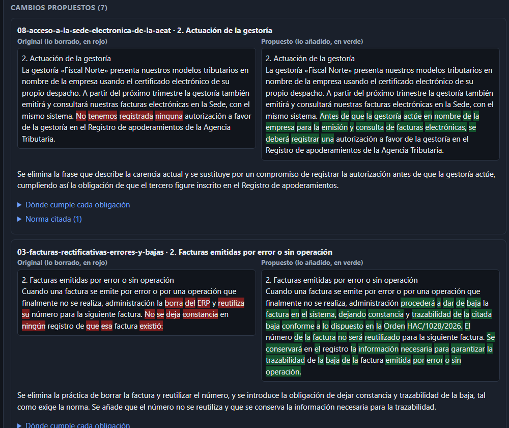
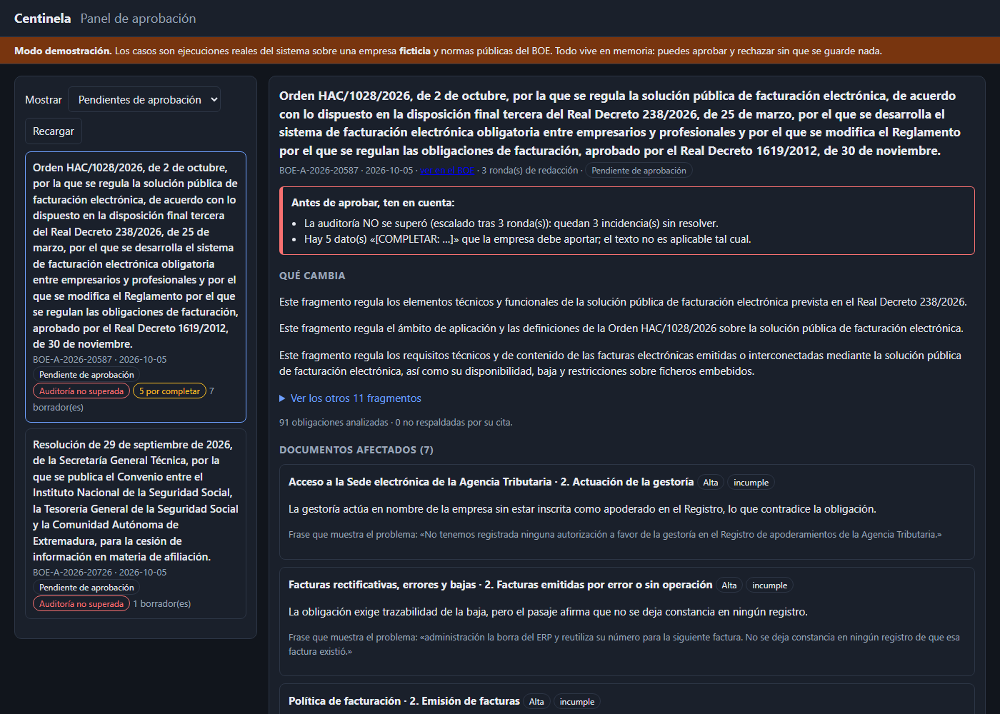
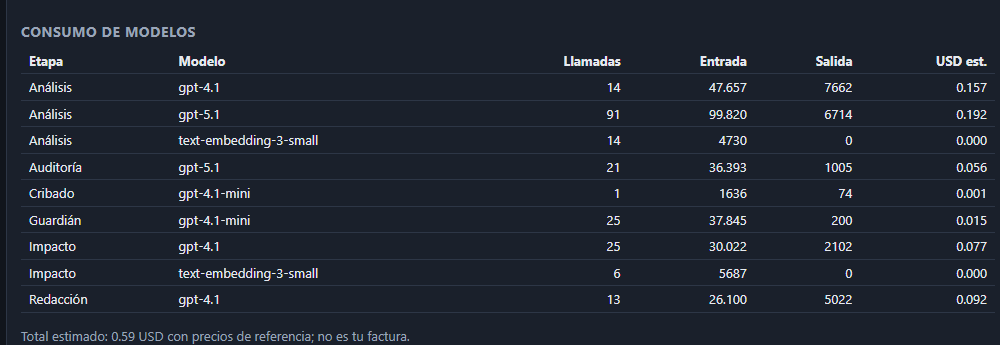
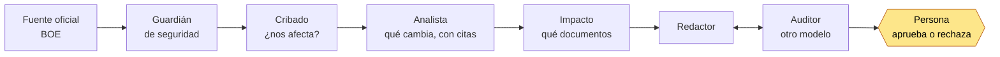
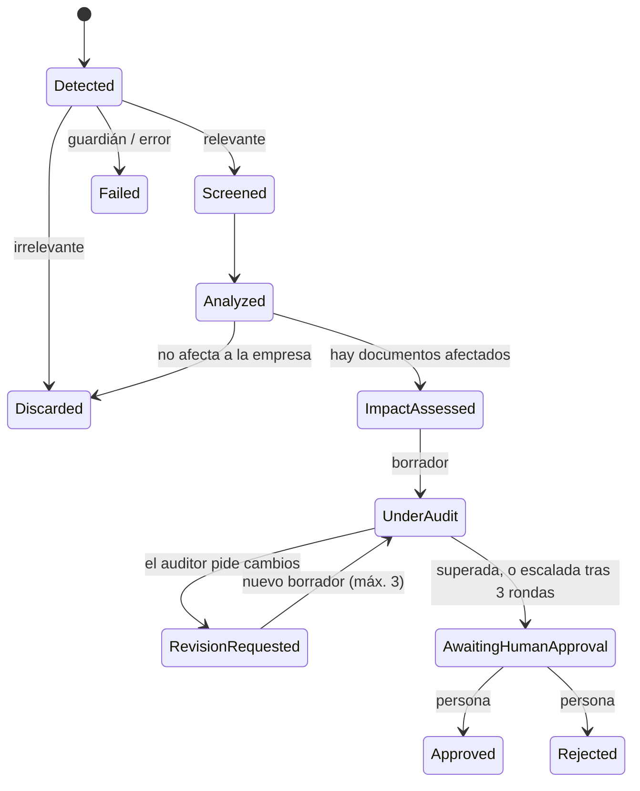

# Centinela

**Agentes de IA que vigilan el BOE, te dicen qué documentos de tu empresa quedan desfasados y proponen la corrección.
Y que, sobre todo, miden con honestidad cuánto se les puede creer.**

[](https://github.com/Luigy-Avila-C/centinela-foundry/actions/workflows/ci.yml)


Plataforma de cumplimiento normativo para empresas españolas, construida **solo con Azure AI Foundry y .NET 10**. Es un proyecto
de aprendizaje y portafolio, pensado como **guía de arquitectura** para sistemas multiagente en los que importa que el resultado sea
verificable. Todo (código en inglés, comentarios y documentación en español) está abierto para que lo despliegues, lo rompas y lo mejores.



> **Aviso.** Los documentos de la «empresa» son **ficticios**. Centinela **no es asesoría jurídica** y **nunca aprueba ni aplica nada por su
> cuenta**: cada propuesta espera a una persona. Los resultados de este repositorio son de un proyecto de investigación, con muestras
> pequeñas y datos de ejemplo; los límites están dichos más abajo y en la documentación.

## Pruébalo en 2 minutos, sin Azure

Necesitas el [.NET 10 SDK](https://dotnet.microsoft.com/download) y nada más: ni cuenta, ni claves, ni coste.

```bash
git clone https://github.com/Luigy-Avila-C/centinela-foundry.git
cd centinela-foundry
Demo__Enabled=true dotnet run --project src/Centinela.Api      # PowerShell: $env:Demo__Enabled="true"; dotnet run --project src/Centinela.Api
# abre http://localhost:5182
```

Carga **tres ejecuciones reales** del sistema en memoria (la Orden HAC/1028/2026 de factura electrónica sobre una empresa inventada, un
falso positivo del cribado y un caso ya aprobado). Puedes comparar original y propuesto, ver por qué el auditor no quedó satisfecho,
cuánto costó cada etapa y aprobar o rechazar sin que se guarde nada.

<p align="center">
  
  
</p>

## Qué problema ataca

Una pyme no puede leer el BOE cada día. Los cambios (Verifactu, factura electrónica, protección de datos…) se conocen tarde y casi
siempre por un tercero, y revisar a mano qué contratos y políticas internas quedan desfasados es lento y propenso a errores.
Centinela lo hace de forma autónoma, **pero con una exigencia: cada afirmación de un modelo se comprueba con código antes de creérsela.**

## Cómo funciona



| Agente | Qué hace | Cómo se evita creerle a ciegas |
|---|---|---|
| **Guardián** | Detecta prompt injection en el texto externo | Reglas de código + modelo + filtro de Azure; el modelo solo cuenta si cita una frase **literal** |
| **Cribado** | Descarta barato lo que no afecta | Embudo de barato a caro, con topes de gasto |
| **Analista** | Extrae obligaciones de la norma, por artículo | Toda afirmación **cita**, las citas **existen** y un **segundo modelo** comprueba que respaldan |
| **Impacto** | Cruza la norma con los documentos (RAG) | El código verifica la cita literal y que sea un deber **de la empresa** |
| **Redactor** | Reescribe con cambio mínimo; no inventa datos (`[COMPLETAR: …]`) | Comprobaciones de código: cifras inventadas, citas válidas, lo conservado |
| **Auditor** | Revisa al redactor con un modelo distinto | **Decide el código**; el modelo solo aporta incidencias verificables |

El **orquestador es código, no un LLM**: la secuencia es determinista, reproducible y auditable. El bucle redactor ⇄ auditor está
acotado a 3 rondas y, si no converge, **escala a una persona** en lugar de iterar sin fin.



Si un caso se escaló o tiene datos `[COMPLETAR]` pendientes, el **dominio** (no la interfaz) exige que quien lo apruebe lo reconozca
expresamente, y queda escrito en el historial.

## Lo que se ha medido (y lo que no funciona)

Cada agente se evaluó con conjuntos etiquetados, criterios fijados **antes** de mirar la parte reservada (`test`) y documentando los
fallos. Detalle y limitaciones de cada cifra en [`docs/EVALUACION.md`](docs/EVALUACION.md).

| Pieza | Resultado | Lectura honesta |
|---|---|---|
| Verificador de citas (32 casos) | Detecta 9/9 afirmaciones malas; 1-2 de 7 falsas alarmas | El juez independiente (`gpt-5.1`) es más estricto y **no cumple** el umbral de falsas alarmas fijado; se dejó dicho |
| Cobertura de la norma | El análisis por artículo cierra las omisiones; el medidor estricto da 10-12 % de «fugas» | El medidor laxo daba 100 % y **era un espejismo** (control negativo: 20-41 % de falsos «cubierto») |
| Evaluador de impacto | 3/3 sensibilidad y 3/3 precisión en los reservados | Datos **ficticios** y 7 positivos: prueba de concepto, no fiabilidad |
| Auditor | 6/6 defectuosos rechazados, 2/3 buenos aprobados | El código solo caza la mitad; el modelo es ruidoso (rechaza ≈ 40 % de buenos) y el voto por mayoría **no** mejoró |
| Guardián | 12/12 ataques, 0 falsos positivos en normas reales | Los ataques y las reglas los diseñó la misma persona: 12/12 no es una garantía |
| **Flujo completo** | **2-3 de cada 5 ejecuciones superan al auditor**; el resto escala a una persona | La aprobación humana **no es un trámite** |
| Coste | ≈ **0,60 USD** por caso completo | Una sola medición; ver [costes](docs/DESPLIEGUE.md#0-qué-vas-a-crear-y-qué-cuesta) |

**Lecciones que más pesan** (por si te sirven en tu propio sistema):
1. **Un LLM como medidor de otro LLM se vuelve permisivo.** Una métrica que da 100 % sin un control negativo no mide nada.
2. **Verifica el juicio del modelo en código** (citas literales, reglas de dominio) y descarta lo que no se pueda comprobar.
3. **Mide el ruido antes de fijar umbrales.** Un umbral fijado con una sola medición falló por puro azar sin que cambiara el código; hizo falta
   medir 9 repeticiones para calibrarlo.
4. **Un embudo de barato a caro** (sumario → cribado → flujo completo) y topes de gasto hacen viable la autonomía.
5. **Documenta los resultados negativos.** Este repositorio recoge un voto por mayoría que no funcionó, un umbral que no se cumplió y un fallo del
   cribado descubierto al usarlo con el BOE real.

## ¿Sirve para otra cosa?

Los **patrones** no son específicos del BOE: orquestador determinista, «el modelo propone y el código verifica», generador y crítico independientes con
puerta humana, guardián de entrada en capas, embudo de coste y evaluación continua. Se pueden aplicar a otros casos en los que una fuente citable cambia y
hay documentos internos que revisar (políticas de seguridad frente a un cambio de norma ISO, protección de datos, revisión de contratos, documentación
técnica…). **Solo se ha medido el caso normativo**: para otro dominio hay que reescribir los prompts, las fuentes y, sobre todo, los conjuntos de evaluación.
Qué es genérico, qué hay que reescribir y qué condiciones deben darse: [`docs/ARQUITECTURA.md`](docs/ARQUITECTURA.md#11-reutilizar-la-arquitectura-en-otro-dominio).

## Despliégalo en tu Azure

Con los niveles gratuitos de Search y Cosmos, **un entorno parado no cuesta nada**; solo pagas los tokens de lo que ejecutes:

| Qué haces | Coste aproximado |
|---|---:|
| Pruebas (`dotnet test`) y modo demo | 0 |
| Cribar un día del BOE (`vigilar --simular`) | ≈ 0,01 USD |
| Puerta de evaluación (`puerta`) | ≈ 0,15 USD |
| Un caso completo (`caso real`) | ≈ 0,60 USD |
| Worker activo, con su tope de 3 casos al día | ≈ 1,9 USD al día (proyección) |

Son **mediciones sueltas** con precios de referencia (contrástalos para tu región), no una factura. La guía completa, con los comandos de
principio a fin, cómo proteger tu crédito, qué hacer si ya usaste tus niveles gratuitos y la solución de problemas está en
**[`docs/DESPLIEGUE.md`](docs/DESPLIEGUE.md)**. En resumen:

```bash
az login
az deployment sub create --name centinela-dev --location spaincentral --template-file infra/main.bicep \
  --parameters principalId=$(az ad signed-in-user show --query id -o tsv)      # ≈ 10 min: Foundry + 4 modelos + Search + Cosmos
# define Foundry__ProjectEndpoint, Search__Endpoint y Cosmos__Endpoint con los valores que devuelve (docs/DESPLIEGUE.md, paso 6)
dotnet run --project src/Centinela.Cli -- indexar BOE-A-2012-14696 BOE-A-2026-7295
dotnet run --project src/Centinela.Cli -- empresa-indexar datos/empresa-ejemplo
dotnet run --project src/Centinela.Cli -- caso real                           # ≈ 0,60 USD
```

Sin claves en ningún sitio: todo se autentica con Microsoft Entra ID.

## Estructura

```
src/
  Centinela.Domain          Entidades y máquina de estados (sin dependencias)
  Centinela.Application     Agentes, orquestador, vigilante, comprobación de citas (no conoce a Foundry)
  Centinela.Infrastructure  Foundry, AI Search, Cosmos DB, BOE, telemetría
  Centinela.Api             API mínima + panel de aprobación (+ modo demo)
  Centinela.Worker          Vigilante programado (desactivado por defecto)
  Centinela.Evaluation      Conjuntos etiquetados, medidores y puerta de evaluación (no se despliega)
  Centinela.Cli             Comandos: cribar, analizar, caso, vigilar, puerta, evaluar-*…
tests/Centinela.Tests       Más de 350 pruebas, ninguna necesita Azure
infra/                      Bicep: Foundry, Search, Cosmos
evaluaciones/               Conjuntos etiquetados, umbrales de la puerta y resultados
datos/                      Empresa ficticia de ejemplo y casos de la demo
docs/                       Arquitectura, despliegue y hoja de ruta
```

## Documentación

- [`docs/DESPLIEGUE.md`](docs/DESPLIEGUE.md): paso a paso, costes y solución de problemas.
- [`docs/ARQUITECTURA.md`](docs/ARQUITECTURA.md): capas, flujo, agentes, seguridad, persistencia y las decisiones de diseño.
- [`docs/EVALUACION.md`](docs/EVALUACION.md): cómo se midió cada agente, con las cifras y **qué no demuestra cada medida**.
- [`docs/HOJA-DE-RUTA.md`](docs/HOJA-DE-RUTA.md): estado de cada capacidad y lo que queda.
- [`datos/README.md`](datos/README.md): la empresa ficticia y cómo usar tus propios documentos.

## Contribuir

Hay mucho por mejorar y las contribuciones son bienvenidas: lee [`CONTRIBUTING.md`](CONTRIBUTING.md). Buenos puntos de partida:

- **Medir la sensibilidad del cribado por título** (hoy solo hay una lectura manual): hace falta un conjunto etiquetado.
- **Una segunda norma** (Verifactu, protección de datos…) para ver si lo medido se sostiene fuera de la Orden de ejemplo.
- **Autenticación real** con Microsoft Entra ID y roles de revisor en la API (hoy es una clave compartida).
- **Pruebas del repositorio de Cosmos** con el emulador en CI, y pruebas de interfaz del panel.
- **Reducir el ruido del auditor** (rechaza ≈ 40 % de los borradores buenos) o una puerta tras el análisis que detecte normas que no obligan a empresas.
- **Ataques escritos por otra persona** para el guardián: los actuales los diseñó la misma persona que las reglas, así que no son una medida independiente.

## Licencia

[MIT](LICENSE). Los textos de las normas proceden del BOE (datos abiertos); la empresa de ejemplo es inventada.
