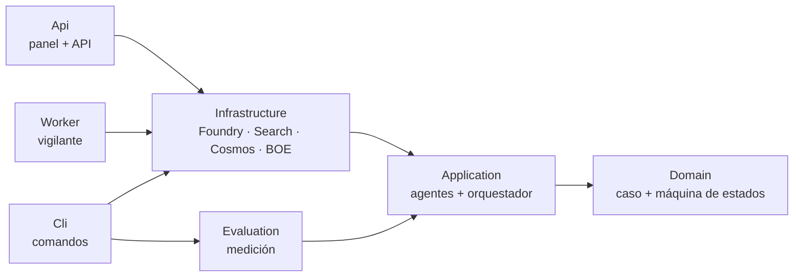
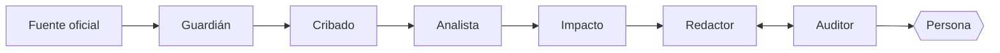
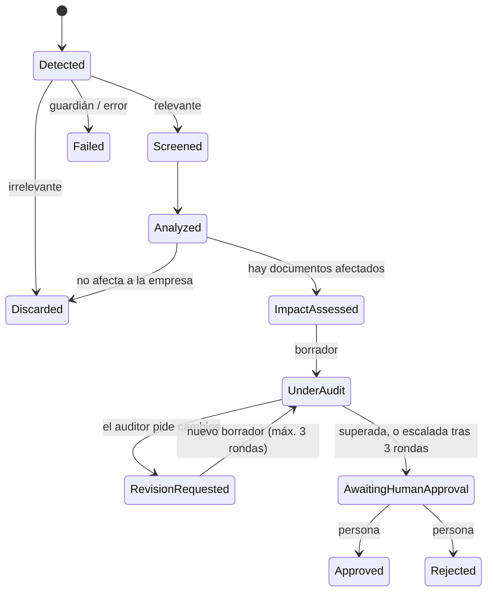

# Arquitectura

Centinela es un sistema multiagente que vigila publicaciones oficiales, determina qué documentos internos de una empresa quedan
afectados y propone la corrección, dejando siempre la decisión final a una persona. Este documento describe **cómo está construido y por
qué**. Las medidas de calidad de cada pieza, con sus cifras y límites, están en [`EVALUACION.md`](EVALUACION.md); el despliegue y los costes,
en [`DESPLIEGUE.md`](DESPLIEGUE.md).

## 1. Principios de diseño

1. **El modelo propone, el código verifica.** Todo juicio de un modelo que pueda comprobarse se comprueba en código (una cita literal debe
   aparecer en el texto, un sujeto debe ser la empresa, una cifra debe existir en el original…). Lo que no se puede comprobar se descarta.
2. **El orquestador es código, no un LLM.** La secuencia de pasos es determinista, reproducible y auditable; los modelos solo hacen lo
   que requiere lenguaje.
3. **Generador y crítico son modelos distintos.** Un modelo tiende a aprobar su propio trabajo: el que redacta y analiza (`gpt-4.1`) no es el
   que juzga (`gpt-5.1`).
4. **Una persona decide siempre.** No existe ningún camino de código que apruebe o aplique un cambio sin una persona. Si el bucle de
   revisión no converge, **escala** a una persona en lugar de iterar sin fin.
5. **Barato antes que caro.** Los pasos se ordenan por coste (reglas de código → modelo pequeño → flujo completo) y el gasto autónomo
   tiene topes.
6. **Sin secretos.** Toda autenticación es con Microsoft Entra ID; no hay claves de API en el repositorio ni en la configuración.
7. **Las medidas se cuentan como son.** Cada agente se evalúa con conjuntos etiquetados, criterios fijados antes de mirar la parte
   reservada y límites documentados.

## 2. Capas y proyectos



| Proyecto | Responsabilidad | Depende de |
|---|---|---|
| `Centinela.Domain` | `ComplianceCase` (agregado raíz) y la máquina de estados. Es el único que cambia el estado de un caso. | nada |
| `Centinela.Application` | Contratos de los agentes, sus implementaciones (que solo hablan con interfaces), el orquestador `ComplianceWorkflow`, el vigilante, la comprobación de citas, la telemetría y el coste. **No referencia ningún SDK de Azure.** | Domain |
| `Centinela.Infrastructure` | Todo lo que habla con el exterior: Foundry (modelos y embeddings), Azure AI Search, Cosmos DB, BOE, OpenTelemetry. Es la única capa que cambia si se cambia de proveedor. | Application |
| `Centinela.Evaluation` | Conjuntos etiquetados, medidores, ejecutores y la puerta de evaluación. **No se despliega** con la API ni con el Worker. | Application |
| `Centinela.Api` / `Centinela.Worker` / `Centinela.Cli` | Anfitriones: panel y API de aprobación, vigilante programado y línea de comandos. | Infrastructure (el CLI, también Evaluation) |

Reglas: las dependencias apuntan hacia dentro; el runtime (Domain, Application, Infrastructure) no depende de Evaluation; las pruebas
(`Centinela.Tests`, más de 350) usan dobles de los agentes y **no necesitan Azure**.

## 3. El flujo



`ComplianceWorkflow` recorre los pasos en orden y guarda el caso al terminar. Un caso bloqueado por el guardián no llega a ningún otro agente,
y un caso irrelevante se descarta pronto.



- Cualquier paso de trabajo puede terminar en `Failed`; un caso fallido queda registrado con su motivo y no se pierde ni se queda a medias.
  Un caso ya decidido por una persona (`Approved` o `Rejected`) es definitivo y no puede pasar a `Failed`.
- **Aprobar exige reconocer los riesgos conocidos.** Si el caso se escaló sin superar la auditoría o tiene datos `[COMPLETAR: …]` pendientes,
  `ComplianceCase.Approve` lanza `RiskNotAcknowledgedException` salvo que quien aprueba lo reconozca expresamente; el reconocimiento queda
  escrito en el historial. Lo impone el dominio, no la interfaz.
- Un caso se puede **guardar y restaurar** (`ToSnapshot` / `Restore`) sin saltarse la máquina de estados: las transiciones posteriores se
  validan igual que en un caso nuevo.

## 4. Los agentes

| Agente | Función | Cómo se evita creerle a ciegas |
|---|---|---|
| **Guardián** | Detecta inyección de instrucciones en el texto externo | Reglas de código + modelo (cuyo hallazgo debe citar una frase literal) + filtro de contenido de la plataforma |
| **Cribado** | Descarta barato lo que no afecta a la empresa | Embudo de coste; el cribado por título no se fía de nada que no haya pasado por el guardián |
| **Analista** | Extrae las obligaciones de la norma, con citas | Tres niveles de verificación de citas |
| **Impacto** | Cruza las obligaciones con los documentos de la empresa | El código verifica la cita literal, el sujeto, el tipo y la base de cada hallazgo |
| **Redactor** | Reescribe cada pasaje afectado con cambio mínimo | Comprobaciones de código sobre el borrador; no inventa datos |
| **Auditor** | Revisa al redactor con otro modelo | La decisión es del código; el modelo solo aporta incidencias verificables |

### 4.1 Guardián de seguridad

El texto de las fuentes oficiales es **entrada no confiable**: se descarga de internet y podría llevar instrucciones para manipular a un modelo.
El guardián lo inspecciona antes de que lo vea ningún otro agente. Tres capas independientes; el texto es inseguro si **cualquiera** encuentra algo:

1. **Reglas de código** (`InjectionHeuristics`): frases de anulación de instrucciones (ES/EN/FR/CA), órdenes dirigidas a una IA, órdenes de
   resultado («clasifica como no relevante», JSON forzado), exfiltración, cierres de las etiquetas que usan los propios prompts, caracteres
   invisibles, texto oculto en caracteres de etiqueta Unicode, base64 que decodifica a texto, y normalización contra anchura completa y
   homoglifos cirílicos y griegos. Cada regla es estrecha a propósito: el texto legal está lleno de órdenes («se ordena», «deberán»).
2. **Un modelo rápido** (`gpt-4.1-mini`) que busca órdenes dirigidas a una IA que las reglas no conocen. **Su hallazgo solo cuenta si copia
   literalmente una frase que existe en el texto**; si no se puede comprobar, se descarta. Si responde fuera de esquema se bloquea (puede
   haber sido manipulado por el propio texto).
3. **El filtro de contenido de la plataforma** (Azure): un rechazo HTTP 400 `content_filter` se trata como hallazgo, no como fallo.

Ante un fallo real (red, cuota) el caso no avanza (fallo cerrado).

### 4.2 Cribado

Decide con un modelo pequeño si una publicación puede obligar a la empresa a cambiar algo. La política es «ante la duda, relevante», salvo lo
que solo regula a las propias administraciones (convenios, encomiendas, nombramientos, subvenciones concretas, actos dirigidos a una persona
determinada). Se ejecuta sobre el título y el departamento antes de descargar el texto entero.

### 4.3 Analista normativo y recuperación (RAG)

- **Troceado por artículo:** cada fragmento (`TextChunk`) es un artículo o anexo con identificador estable (`BOE-A-2026-20587_007`); los
  artículos largos se parten por párrafos.
- **Búsqueda híbrida** en Azure AI Search: texto (analizador español) más vector (`text-embedding-3-small`, 1536 dimensiones). Hay dos índices
  separados, `normativa` y `empresa` (el mismo `IChunkIndex`, resuelto por clave). Los embeddings van por el endpoint de la cuenta
  (`<recurso>.openai.azure.com`), porque el del proyecto no los sirve.
- **Análisis por artículo (modo por defecto):** cada artículo se analiza en su propia llamada, recorriéndolo apartado por apartado y conservando
  la condición bajo la que aplica cada hecho. Solo puede citar su propio texto y la normativa previa recuperada para él. Se saltan el
  preámbulo y los anexos.
- **Citas en tres niveles**, de más barato a más caro: (1) *estructura* (código): el análisis es una lista de afirmaciones atómicas y cada una
  lleva al menos una cita; (2) *existencia* (código): solo se puede citar un fragmento entregado al modelo; (3) *respaldo* (verificador): un
  modelo independiente lee **solo** los fragmentos citados por una afirmación y dice si la respaldan (`respaldada`, `parcial`,
  `no_respaldada`). Los «artículos afectados» no los dicta el modelo: se calculan de las etiquetas de los fragmentos citados.
- **Límites del diseño:** no hay un «diff» real contra la versión anterior de una norma (se contrasta con la normativa relacionada indexada);
  las normas previas se indexan a mano (`indexar`), aunque el XML del BOE incluye referencias a otras normas que permitirían automatizarlo.

### 4.4 Evaluador de impacto

Responde: *de los documentos internos, ¿qué pasajes deja desfasados o incumplidos esta norma?*

```
obligaciones del análisis ─► búsqueda híbrida en el índice «empresa» ─► un juicio por pasaje ─► verificación en código
```

- **Recupera por obligación y juzga por pasaje:** escala a muchos documentos (la búsqueda filtra) y cada pasaje se juzga una vez con las
  obligaciones que lo señalaron.
- **El código verifica el juicio.** Cada hallazgo debe traer una cita literal del pasaje y una *exigencia* literal de la obligación. Solo
  cuenta si la obligación es un **deber de la empresa** (o de un tercero del que el pasaje dice que depende), demostrado con algo que el
  pasaje **afirma** y no con lo que calla. Una facultad («podrá»), una condición, la obligación de otro sujeto o un «no se menciona» se
  descartan. El juez etiqueta sujeto, tipo y base, y el código aplica las reglas.
- Para cada pasaje guarda el *alcance* literal que le aplica (de entre los deberes que a veces junta una obligación compuesta); el redactor y
  el auditor lo reciben.

### 4.5 Redactor

Por cada pasaje afectado devuelve el **pasaje completo reescrito** (puede sustituir al original) con **cambio mínimo**. No inventa datos de la
empresa: lo que no sabe lo deja como `[COMPLETAR: …]`. Por cada obligación cita literalmente dónde la cumple; no fija fechas. Recibe la lista
exacta de identificadores de norma citables (las citas se normalizan: «…_009.6» → «…_009»). En las rondas siguientes solo reescribe los
pasajes que el auditor objetó.

### 4.6 Auditor

Usa un modelo distinto del redactor y **su decisión la toma el código**:

- Primero corren **comprobaciones automáticas** (`DraftChecks`) independientes de cualquier modelo: cada obligación con una cita literal
  verificada de dónde se cumple; ninguna cifra que no esté en el original, las obligaciones o la norma; al menos el 50 % de las palabras del
  original conservadas; citas a la norma válidas; borrador distinto del original; y que **no conserve intacta** la frase que mostraba el
  incumplimiento (una corrección que *modifica* la frase, p. ej. «…, salvo…», no se marca). Los `[COMPLETAR]` se cuentan pero no bloquean.
- Después, las incidencias del modelo, que **solo cuentan si son verificables** (una sobre el texto debe traer una cita literal del
  borrador; una sobre una obligación, señalar una que exista).
- Es posible pedir varios votos por auditoría (`Auditor:Votes`, por mayoría); está desactivado porque no mejoró la consistencia (ver
  [`EVALUACION.md`](EVALUACION.md#auditor)).

## 5. Persistencia, API y panel

- **Cosmos DB** (nivel gratuito, sin claves de cuenta, solo Entra ID): un documento por caso, clave de partición `/id`. Se desnormalizan los
  campos de lista (título, estado, recuentos, «escalado», «caro») y el snapshot queda fuera del índice. Se guarda el caso compactado: sin el
  texto íntegro de la norma (se vuelve a pedir al BOE por su identificador) y solo con los fragmentos que el caso cita. Concurrencia
  optimista con **ETag**: dos revisores no se pisan (el segundo recibe un conflicto). Hay una implementación en memoria con la misma
  semántica para pruebas y demo.
- **API mínima** (`GET /api/cases`, `GET /api/cases/{id}`, `POST …/approve`, `POST …/reject`). Protegida con una **clave compartida**
  (`X-Api-Key`, comparación en tiempo constante); no arranca sin ella salvo en desarrollo y en la demo. Cabeceras de seguridad y CSP sin
  scripts en línea. No lanza casos: eso lo hacen el CLI y el Worker.
- **Panel** (HTML, CSS y JS estáticos): lista los casos, muestra original y propuesto con las diferencias palabra a palabra, los
  `[COMPLETAR]` resaltados, dónde cumple cada obligación, el texto de la norma citada, las incidencias del auditor, el consumo de tokens y el
  historial. Todo lo que viene de modelos se escribe como texto, nunca como HTML.
- **Modo demo** (`Demo__Enabled=true`): carga en memoria los casos de `datos/demo` (ejecuciones reales sobre la empresa ficticia, exportadas con
  `centinela exportar-caso`) y el panel entra solo. Se niega a arrancar si hay un `Cosmos:Endpoint` configurado, para que una demo no pueda
  escribir en datos reales.

## 6. El vigilante

`RegulatoryWatcher` repasa el sumario del BOE (secciones I y III) y abre casos de forma autónoma **solo hasta dejarlos pendientes de
aprobación humana**. Lo ejecuta `Centinela.Worker` o, a mano, `centinela vigilar`. Es un embudo de barato a caro:

1. **Sumario del día** (gratis) y descarte de lo que ya tiene caso (un fallo se reintenta `MaxAttempts` veces y luego se deja a una persona).
2. **Guardián + cribado sobre título y departamento** (un par de llamadas a `gpt-4.1-mini`). Lo descartado se guarda como caso `Discarded`,
   lo que evita volver a cribar la misma publicación.
3. **Solo lo relevante se descarga entero y recorre el flujo completo**, con topes: `MaxNewCasesPerRun` (2) y `MaxNewCasesPerDay` (3, UTC).
   Cada caso lleva una marca «caro» (llegó a gastar análisis o falló después de empezar). Lo relevante que no cabe en el presupuesto **no se
   guarda**: se vuelve a encontrar en la siguiente pasada.

El Worker está **desactivado por defecto** (`Watcher__Enabled=true`); `vigilar --simular` hace todo el cribado sin descargar ni guardar nada.
Una publicación que falla no detiene a las demás y una pasada fallida se reintenta en la siguiente.

## 7. Seguridad: resumen del modelo de amenazas

| Amenaza | Defensa | Límite |
|---|---|---|
| Texto de una fuente con instrucciones para un modelo | Guardián en tres capas, antes de cualquier otro agente | Medido con ataques escritos por el autor; no es una garantía frente a un atacante que conozca las reglas |
| Un modelo inventa una cita o un dato | Verificación en código de citas, cifras y reglas de dominio | Lo que no es verificable por código depende del juicio del modelo |
| Una norma manipulada que *afirma* algo falso (sin dar órdenes) | Citas verificadas y aprobación humana | El guardián no la detecta |
| Aprobar algo sin darse cuenta del riesgo | `Approve` exige reconocer los riesgos conocidos | – |
| Acceso al panel | Clave compartida, cabeceras de seguridad | **Sin usuarios**; para exponerlo hace falta Entra ID con roles de revisor |
| Fuga de datos por la telemetría | Las trazas llevan identificadores, modelos, estados y recuentos; **nunca** texto de normas, prompts, documentos ni mensajes de error | – |
| Gasto descontrolado | Topes de casos, Worker desactivado por defecto, consumo medido por caso | Los topes limitan el número de casos, no los dólares |

Los documentos de la empresa que se usan en los prompts no pasan por el guardián (solo el texto de las fuentes).

## 8. Observabilidad y coste

- **Consumo por caso.** Cada llamada a un modelo apunta sus tokens de entrada y salida (`UsageScope`, con estado ambiental porque los agentes
  llaman en paralelo y por muchas capas). Los ámbitos se anidan: una pasada del vigilante suma lo de todos sus casos. Se guarda **en cada
  caso**, por etapa y modelo, y se muestra en el CLI, el log del Worker y el panel. Los **tokens son una medida real**; los **dólares son una
  estimación** con una tabla de precios de referencia configurable (`Pricing:Models`) que debe contrastarse con la lista de precios de Azure.
- **Trazas y métricas** (OpenTelemetry), desactivadas por defecto (`Telemetry__Enabled=true`). Un tramo raíz `caso`, un hijo `etapa X` por
  etapa y un tramo `gen_ai.responses` por llamada, con las convenciones `gen_ai.*`. Métricas: `centinela.tokens`, `centinela.model.calls`,
  `centinela.cases` y `centinela.watcher.entries`. Exporta a consola o por OTLP a cualquier recolector.
- **Coste medido** de un caso completo (norma larga, analista real): ver [`EVALUACION.md`](EVALUACION.md#consumo-y-coste).

## 9. Evaluación

Cada agente se mide con conjuntos etiquetados en `evaluaciones/`, con una parte de desarrollo (`dev`, para ajustar) y una reservada (`test`,
que se mide una sola vez), umbrales fijados antes de mirar la reservada y límites documentados. `centinela puerta` pasa las evaluaciones con
modelos reales contra umbrales de **regresión** y termina con código 1 si algo empeora; el CI gratuito ejecuta las pruebas, valida el Bicep y
revisa el JavaScript del panel. Todo el detalle está en [`EVALUACION.md`](EVALUACION.md).

## 10. Limitaciones conocidas

- **Datos y etiquetas del autor.** La empresa de ejemplo, los borradores, los ataques y las etiquetas los escribió el autor del proyecto: las
  medidas indican si los agentes razonan bien sobre casos diseñados, no su rendimiento sobre documentos reales y desordenados.
- **Una sola norma** (la Orden HAC/1028/2026) en casi todas las medidas; muestras pequeñas con intervalos de confianza muy anchos.
- **El flujo completo no converge siempre:** solo 2 o 3 de cada 5 ejecuciones superan al auditor; el resto escala a una persona. La
  aprobación humana no es un trámite.
- **El auditor es ruidoso** (rechaza ≈ 40 % de los borradores buenos) y no mide el redactor real a la primera.
- **Sin usuarios en la API** (clave compartida).
- **Sensibilidad del cribado por título sin medir.**
- **El repositorio de Cosmos no tiene pruebas automáticas** (se probó contra una cuenta real; no hay emulador en el CI), ni el panel pruebas de interfaz.
- **Los flujos de GitHub Actions** no se han ejecutado en GitHub; el de evaluaciones requiere configurar una identidad OIDC.

## 11. Reutilizar la arquitectura en otro dominio

Centinela resuelve un problema concreto (normativa española y documentos de una pyme), pero **los patrones de diseño no son específicos de él**. Esta
sección separa lo que es genérico de lo que está atado al dominio. **Solo se ha medido el caso normativo**: lo que sigue es un análisis de qué se puede
reutilizar, no una afirmación de que funcione igual en otro dominio.

**Patrones genéricos** (válidos para cualquier sistema multiagente en el que importe que el resultado sea verificable):

| Patrón | Dónde está | Idea |
|---|---|---|
| Orquestador determinista con estado | `ComplianceCase`, `ComplianceWorkflow` | La secuencia es código; el estado solo cambia por transiciones válidas; un fallo queda registrado |
| El modelo propone, el código verifica | `QuoteMatch`, `DraftChecks`, verificación en `ImpactAgent` y `AuditorAgent` | Toda cita o dato que un modelo afirma se comprueba contra el texto fuente; lo que no se puede comprobar se descarta |
| Generador y crítico independientes, con bucle acotado | Redactor ⇄ auditor (`Auditor`, 3 rondas) | Modelos distintos, decisión en código, y escalado a una persona si no converge |
| Puerta humana con reconocimiento de riesgos | `ComplianceCase.Approve` | Nada se aplica sin una persona, y los riesgos conocidos hay que reconocerlos |
| Guardián de entrada en capas | `SecurityGuardAgent`, `InjectionHeuristics` | Reglas + modelo con hallazgos verificables + filtro de la plataforma, con fallo cerrado |
| Embudo de coste con topes | `RegulatoryWatcher` | Del filtro más barato al flujo completo, con presupuesto por pasada y por día |
| Medición continua | `Centinela.Evaluation`, `puerta` | Conjuntos etiquetados, parte reservada, umbrales de regresión calibrados con el ruido medido |
| Consumo y trazas por caso | `UsageScope`, `Telemetry` | Tokens por etapa y modelo guardados en cada caso; trazas sin contenido |

**Piezas de infraestructura reutilizables casi tal cual** (no mencionan el dominio): `QuoteMatch`, `UsageScope`, `Telemetry`, el repositorio de casos con
ETag (`CaseRepository`, Cosmos y memoria), el reintento ante límites de velocidad, el panel y la API de aprobación (salvo los textos).

**Lo que hay que reescribir para otro dominio:** los *prompts* y los nombres de los agentes (hoy hablan de «norma», «obligación» y «pasaje»), el cribado y su
perfil de empresa, las fuentes (`IRegulatorySource`: hoy el BOE), el cargador de documentos internos (`CompanyDocumentLoader`), las reglas de dominio del
evaluador de impacto (sujeto, deber, base) y, sobre todo, **los conjuntos etiquetados y los umbrales**. Los puntos de intercambio son interfaces:
`IRegulatorySource`, `IChunkIndex`, `ILanguageModel`, `IEmbeddingModel` y los contratos de cada agente.

**Condiciones para que el patrón tenga sentido:** (1) un **texto fuente citable**, para que «el código verifica» tenga contra qué comprobar; (2) un corpus
interno de documentos con los que cruzarlo; (3) una **persona** que pueda aprobar, porque el sistema está diseñado para proponer y no para decidir; (4) estar
dispuesto a **medir de nuevo**: la calidad de este repositorio no se transfiere a otro dominio.

**Ejemplos de dónde encajaría el patrón** (ninguno probado):

- **Cumplimiento y seguridad de la información:** un cambio en una norma ISO, el ENS o un requisito de un cliente frente a las políticas y procedimientos internos.
- **Protección de datos:** una nueva guía de la autoridad de control frente a la política de privacidad, los contratos de encargado del tratamiento y los registros de actividades.
- **Revisión de contratos:** un *playbook* o una cláusula tipo actualizados frente a un conjunto de contratos vigentes, con cita literal de cada cláusula afectada.
- **Documentación técnica:** el cambio en una API o en un estándar frente a las guías, los manuales y los ejemplos que quedan desfasados.
- **Recursos humanos y laboral:** un cambio de convenio o de legislación laboral frente al manual del empleado y las plantillas.
- **Sanidad o calidad:** una guía clínica o un procedimiento normalizado actualizados frente a los protocolos internos (con revisión humana obligatoria, por el riesgo).

## 12. Decisiones abiertas

- Estrategia de versionado de la normativa para calcular el «qué cambia» de verdad (hoy no hay diff contra una versión consolidada).
- Autenticación con Entra ID y roles de revisor en la API.
- Cómo evaluar el cribado por título y el flujo completo de punta a punta.
